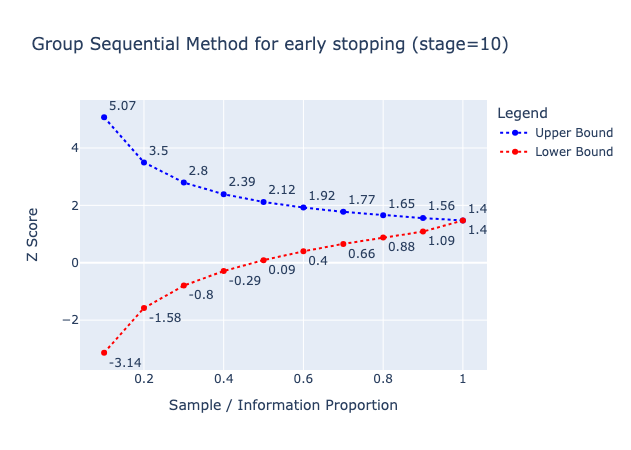

# A/B/n Testing Package

## [Medium Blog Post](https://medium.com/@denim.bluu/experimentation-analysis-sequential-test-designs-88b0ac41a9f5)


## Overview

This is a comprehensive Python library that facilitates advanced statistical testing methods, designed to empower data scientists and analysts in their work. This package specifically focuses on:

- Power Testing using Monte Carlo Simulation
- Multiple A/B/n Testing
- Sequential Test Design

## Features

### Power Testing with Monte Carlo Simulation

Power testing is a crucial step in the design of experiments, as it calculates the likelihood that a test will detect an effect of a certain size, given a particular level of statistical significance. This package employs Monte Carlo simulation to generate a large number of random samples from the population, thus providing a more robust and accurate power calculation.

### Multiple A/B/n Testing

Traditional A/B testing compares two versions (A and B) to identify which performs better for a particular metric. However, this goes beyond this by supporting Multiple A/B/n Testing, where 'n' could be any number of versions greater than two. This feature enables you to simultaneously compare multiple variants, thereby increasing the efficiency of your testing processes.

### Sequential Test Design

Sequential test design is an advanced methodology that allows the test to be stopped as soon as sufficient data have been collected, thereby saving time and resources. This package supports this type of design, enabling quicker decision-making without compromising the integrity of the results.

#### Example

```python
from src.seq_design.boundary import sequential_design, vis_sequential_design

bound = sequential_design(k=10, alpha=0.1, beta=0.2)

vis_sequential_design(bound)
```


